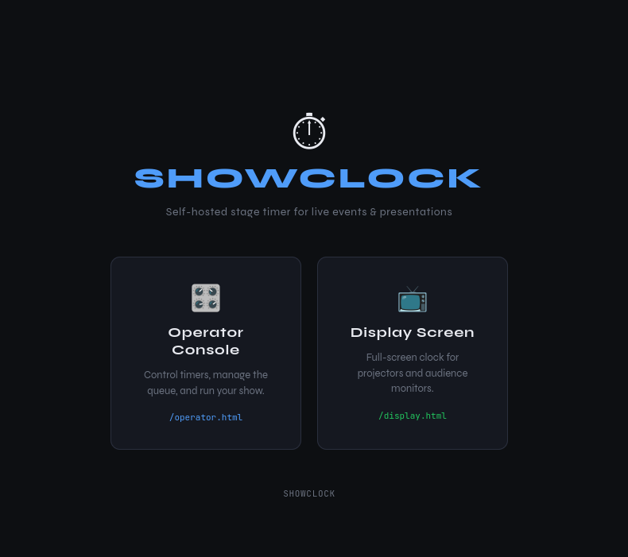

# ShowClock

A self-hosted stage timer for live events and presentations. Run it in Docker, control it from one browser tab, display it on another.

> [!CAUTION]
Archiving this in favor of [Podbooth](https://github.com/fuzzymistborn/podbooth) which incorporates many of the same features but with a lot more functionality

> [!WARNING]
> Disclosure: This was written by AI.  So while it has been tested for bugs/functionality, I cannot guarantee its security (though I have run a few prompts specifically focused on security/vulnerabilities).  Run at your own risk!  I would highly recommend running over something like Tailscale or Wireguard for secure access.

## Screenshots

<table align="center">
  <tr>
    <td align="center"><a href="images/landing-page.png"></a></td>
    <td align="center"><a href="images/operator-page.png"></a></td>
  </tr>
  <tr>
    <td align="center"><sub>Landing Page</sub></td>
    <td align="center"><sub>Operator Console</sub></td>
  </tr>
  <tr>
    <td align="center"><a href="images/display-page.png"></a></td>
    <td align="center"><a href="images/settings-page.png"></a></td>
  </tr>
  <tr>
    <td align="center"><sub>Display Screen</sub></td>
    <td align="center"><sub>Settings Panel</sub></td>
  </tr>
</table>

## Quick Start

**Option 1 — Build from source:**
```bash
git clone https://github.com/fuzzymistborn/showclock.git
cd showclock
docker compose up -d
```

**Option 2 — Pre-built image from GHCR:**
```bash
docker pull ghcr.io/fuzzymistborn/showclock:latest
```

```yaml
services:
  showclock:
    image: ghcr.io/fuzzymistborn/showclock:latest
    container_name: showclock
    ports:
      - "3000:3000"
    restart: unless-stopped
    environment:
      - PORT=3000
      - DB_PATH=/data/showclock.db
      - OPERATOR_PASSWORD=your-password-here   # optional — omit to disable auth
      - SESSION_TTL_HOURS=24 # optional - session lifetime in hours (default: 24)
      - OPERATOR_SECRET=your-random-secret-here # optional - fix the internal WS auth token so it persists across restarts
      - TRUST_PROXY=true # optional - set if behind a TLS-terminating reverse proxy
    volumes:
      - /YOURPATH/showclock:/data
```

| URL | Purpose |
|-----|---------|
| `http://YOUR_IP:3000` | Landing page |
| `http://YOUR_IP:3000/operator.html` | Operator console |
| `http://YOUR_IP:3000/display.html` | Audience display |
| `http://YOUR_IP:3000/login` | Login page |
| `http://YOUR_IP:3000/logout` | Sign out |

## Features

- **Timer queue** — build a list of timers ahead of time, step through them during the show
- **Subtimers** — break a timer into ordered segments that auto-advance
- **Decoupled edit/active** — edit any timer without interrupting the one running on the display
- **▶ Live button** — explicitly promote a timer to the display; optionally auto-starts it
- **Show notes** — per-timer markdown notes that sync live to the display
- **Color thresholds** — green → yellow → red transitions, configurable per timer
- **Flashing** — clock flashes when time runs low, configurable rate
- **Scrubber** — drag the progress bar to jump to any point in the timer
- **+30s button** — add time on the fly
- **Hand-raise queue** — audience members can raise their hand from the display page; operator sees the ordered queue
- **Tailscale identity** — if running behind [tsidp](https://github.com/tailscale/tsidp), hand-raise names are resolved automatically from the Tailscale identity
- **Auto-save** — name, duration, and settings save automatically as you type
- **Settings panel** — set global defaults, toggle auto-start on advance, and set subtimer expand behavior
- **Persistent storage** — SQLite database survives container restarts
- **Auto-reconnect** — display screens reconnect automatically if the server restarts
- **Optional password auth** — protect the operator page with a password set via environment variable

## Operator Console

- **Click a row** to open it in the editor
- **▶ Live** to send a timer to the display (won't stop what's currently running)
- **Space** play/pause · **← →** prev/next · **R** reset
- **⚙ Settings** — default duration, color thresholds, auto-start on advance, subtimer expand behavior
- **✋ Hand Queue** — view raised hands in order, remove individual entries, or clear all

## Timer Settings

| Field | Description | Default |
|-------|-------------|---------|
| Name | Shown on the display | `New Timer` |
| Duration | `mm:ss` or seconds | `5:00` |
| Show Notes | Markdown — rendered on the display below the clock | _(empty)_ |
| Yellow At | Seconds remaining when clock turns yellow | `60` |
| Red At | Seconds remaining when clock turns red | `30` |
| Flash At | Seconds remaining when flashing begins | `30` |
| Flash Rate | ms per flash cycle (`500` fast, `1000` normal) | `1000` |

## Show Notes

Notes are written in standard Markdown in the operator editor and rendered live on the display screen. Supported formatting:

- `**bold**`, `*italic*`
- Bullet lists (`-` or `*`) and numbered lists
- Nested lists (indent with 2 spaces)

Notes sync to the display automatically as you type (500ms debounce).

## Environment Variables

| Variable | Default | Description |
|----------|---------|-------------|
| `PORT` | `3000` | HTTP/WebSocket port |
| `DB_PATH` | `/data/showclock.db` | SQLite database path |
| `OPERATOR_PASSWORD` | _(unset)_ | Password for the operator page. If unset, no login is required |
| `SESSION_TTL_HOURS` | `24` | How long an operator login session lasts (hours) |
| `OPERATOR_SECRET` | _(random)_ | Internal WS auth token. Set explicitly to persist across restarts |
| `TRUST_PROXY` | _(unset)_ | Set to `true` when running behind a TLS-terminating reverse proxy. Enables `Secure` cookie flag, HSTS header, and `X-Forwarded-For` trust for rate limiting |

## Authentication

If `OPERATOR_PASSWORD` is set, visiting `/operator.html` redirects to a login page. Sessions are stored in memory and last 24 hours by default (configurable via `SESSION_TTL_HOURS`). Sessions reset on server restart.

The display page (`/display.html`) and hand-raise interface are always accessible without a password — only the operator console is protected.

## Security

ShowClock is designed primarily for use behind a VPN like Tailscale or Wireguard. If you choose to expose it to the internet, **AT MINIMUM** do the following:

- Set `OPERATOR_PASSWORD` to a strong password.
- Set `OPERATOR_SECRET` explicitly so it persists across restarts.
- Run behind a TLS-terminating reverse proxy (Caddy, nginx, Traefik) and set `TRUST_PROXY=true`.
- Restrict access to trusted networks where possible (firewall rules, Cloudflare Access, etc.).

## Running Without Docker

Requires Node.js 20+.
```bash
npm install
DB_PATH=./showclock.db node server.js
```

## Stack

Node.js · Express · WebSockets · SQLite (`better-sqlite3`) · [marked.js](https://marked.js.org/) · [DOMPurify](https://github.com/cure53/DOMPurify)
