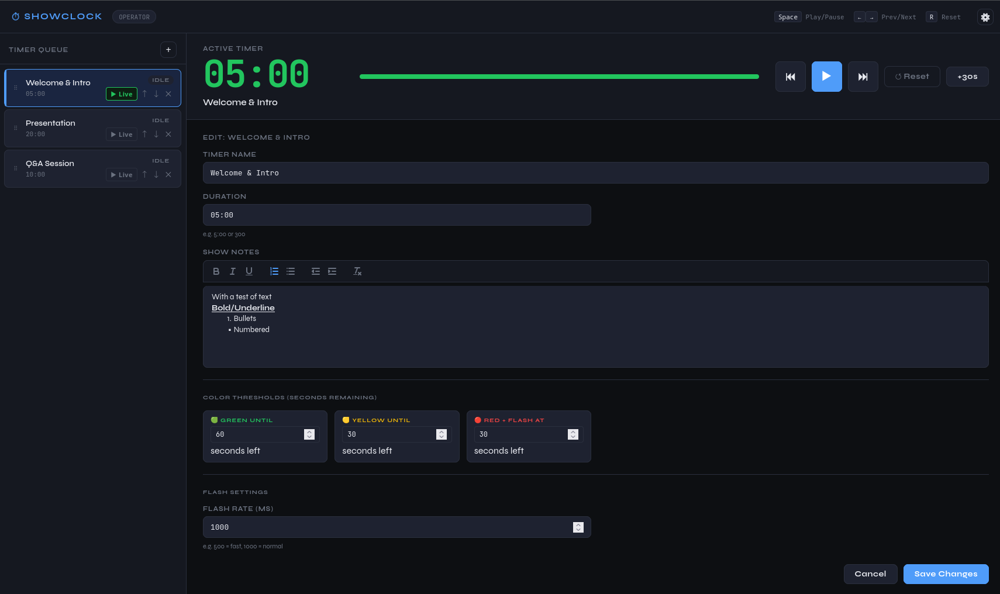
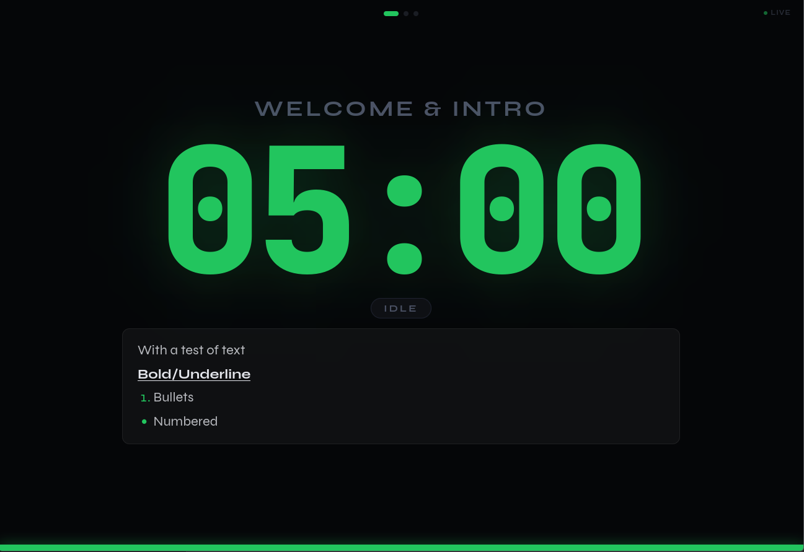
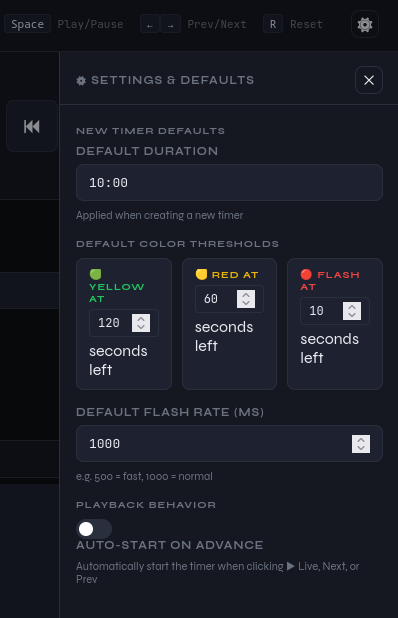

# ShowClock

A self-hosted stage timer for live events and presentations. Run it in Docker, control it from one browser tab, display it on another.

> [!WARNING]
> Disclosure: This was written by AI.  It is NOT meant to be deployed with external access.  There is no authentication and that an intentional decision.  If you need to share access, use something like Tailscale, Wireguard, etc.

## Screenshots

<table align="center">
  <tr>
    <td align="center"><a href="images/operator-page.png"></a></td>
    <td align="center"><a href="images/display-page.png"></a></td>
    <td align="center"><a href="images/settings-page.png"></a></td>
  </tr>
  <tr>
    <td align="center"><sub>Operator Console</sub></td>
    <td align="center"><sub>Display Screen</sub></td>
    <td align="center"><sub>Settings Panel</sub></td>
  </tr>
</table>

## Quick Start

**Option 1 — Build from source:**
```bash
git clone https://github.com/fuzzymistborn/showclock.git
cd showclock
docker compose up -d
```

**Option 2 — Pre-built image from GHCR:**
```bash
docker pull ghcr.io/fuzzymistborn/showclock:latest
```

```yaml
services:
  showclock:
    image: ghcr.io/fuzzymistborn/showclock:latest
    container_name: showclock
    ports:
      - "3000:3000"
    restart: unless-stopped
    environment:
      - PORT=3000
      - DB_PATH=/data/showclock.db
    volumes:
      - /YOURPATH/showclock:/data
```

| URL | Purpose |
|-----|---------|
| `http://YOUR_IP:3000` | Landing page |
| `http://YOUR_IP:3000/operator.html` | Operator console |
| `http://YOUR_IP:3000/display.html` | Audience display |

## Features

- **Timer queue** — build a list of timers ahead of time, step through them during the show
- **Decoupled edit/active** — edit any timer without interrupting the one running on the display
- **▶ Live button** — explicitly promote a timer to the display; optionally auto-starts it
- **Rich show notes** — per-timer notes (bold, bullets, indentation) that sync live to the display as you type
- **Color thresholds** — green → yellow → red transitions, configurable per timer
- **Flashing** — clock flashes when time runs low, configurable rate
- **Scrubber** — drag the progress bar to jump to any point in the timer
- **+30s button** — add time on the fly
- **Auto-save** — name, duration, and settings save automatically as you type
- **Settings panel** — set global defaults and toggle auto-start on advance
- **Persistent storage** — SQLite database survives container restarts
- **Auto-reconnect** — display screens reconnect automatically if the server restarts

## Operator Console

- **Click a row** to open it in the editor
- **▶ Live** to send a timer to the display (won't stop what's currently running)
- **Space** play/pause · **← →** prev/next · **R** reset
- **⚙ Settings** — default duration, color thresholds, auto-start on advance

## Timer Settings

| Field | Description | Default |
|-------|-------------|---------|
| Name | Shown on the display | `New Timer` |
| Duration | `mm:ss` or seconds | `5:00` |
| Show Notes | Rich text shown below the clock | _(empty)_ |
| Yellow At | Seconds remaining when clock turns yellow | `60` |
| Red At | Seconds remaining when clock turns red | `30` |
| Flash At | Seconds remaining when flashing begins | `30` |
| Flash Rate | ms per flash cycle (`500` fast, `1000` normal) | `1000` |

## Environment Variables

| Variable | Default | Description |
|----------|---------|-------------|
| `PORT` | `3000` | HTTP/WebSocket port |
| `DB_PATH` | `/data/showclock.db` | SQLite database path |

## Running Without Docker

Requires Node.js 18+.
```bash
npm install
DB_PATH=./showclock.db node server.js
```

## Stack

Node.js · Express · WebSockets · SQLite (`better-sqlite3`) · [Quill.js](https://quilljs.com/)
